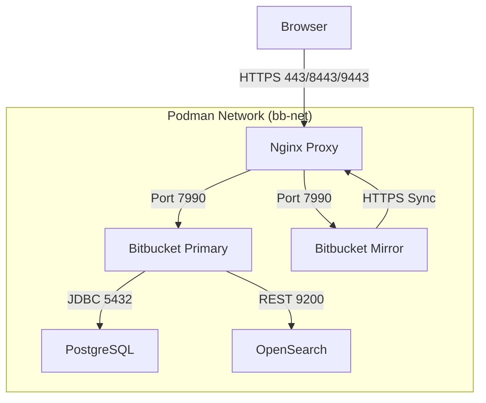

# Bitbucket Data Center + Smart Mirror Automation (Rootless Podman)

This repository contains a unified bash script to deploy a fully functional local development environment for **Bitbucket Data Center** (Primary Node) and a **Bitbucket Smart Mirror**, orchestrated via **Podman** (Rootless).

## Overview

The script automates the provisioning of:
1.  **Bitbucket Primary:** Running on port `8443` (via Nginx).
2.  **Bitbucket Smart Mirror:** Running on port `9443` (via Nginx).
3.  **PostgreSQL 15:** Dedicated database for the Primary node.
4.  **OpenSearch:** Search index for the Primary node.
5.  **Nginx Proxy:** Handles SSL termination (Self-Signed) and routing for both nodes.
6.  **Auto-Configuration:** Generates certificates, SSH logs in via API, and pre-seeds configuration.

## Prerequisites

*   **Linux OS**
*   **Podman** (Rootless configuration recommended)
*   **Bitbucket Data Center License Key** (Trial or Full)

## Quick Start

1.  **Clone the repository:**
    ```bash
    git clone <repository_url>
    cd <repository_name>
    ```

2.  **Configure License:**
    Open `setup-bitbucket-mirror.sh` and locate the `LICENSE_KEY` variable at the top. Paste your valid Bitbucket Data Center license key.
    ```bash
    # setup-bitbucket-mirror.sh
    LICENSE_KEY="AAAB..." 
    ```

3.  **Run the script:**
    ```bash
    chmod +x setup-bitbucket-mirror.sh
    ./setup-bitbucket-mirror.sh
    ```

    *Setup takes approximately 5-10 minutes depending on hardware performance.*

## Architecture



## Post-Installation Steps

After the script completes, you must manually authorize the mirror:

1.  **Log in to Primary:**
    *   URL: `https://localhost:8443`
    *   User: `admin`
    *   Pass: `admin123`

    > **Note on Cloning:**
    > To clone from the mirror, use the **Host URL**: `https://localhost:9443/scm/project/repo.git`.
    > Do not use the internal container URL (`bb-nginx`) shown in the UI if you are running `git clone` from your host terminal.

2.  **Approve Mirror:**
    *   Navigate to **Administration (Gear Icon) -> Mirrors**.
    *   You will see **"Local Mirror"** listed as "Awaiting Authorization".
    *   Click **Authorize**.

3.  **Enable Project Mirroring:**
    *   Click on **"Local Mirror"** in the list.
    *   Type **"DEMO"** in the project search box and click **Add**.
    *   The mirror will begin synchronizing the `repo-1` repository.

## Troubleshooting

*   **SSL Warnings:** Since we generate self-signed certificates (`CN=localhost`), your browser will warn you. This is expected. You must verify permissions/exceptions in your browser.
*   **502 Bad Gateway:** If seen immediately after the script finishes, wait 1-2 minutes. Bitbucket takes time to initialize.
*   **Wait Loops:** The script includes robust wait-for-service logic to prevent database locks, especially for the Mirror node which uses an embedded H2 database.

## Cleaning Up

To stop and remove all containers, networks, and volumes created by this script, simply run the cleanup commands (found at the top of the script) manually:

```bash
podman rm -f bb-primary bb-mirror bb-postgres bb-opensearch bb-nginx
podman volume rm bb-primary-home bb-mirror-home bb-postgres-data
podman network rm bb-net
rm -rf bb-deploy
```
